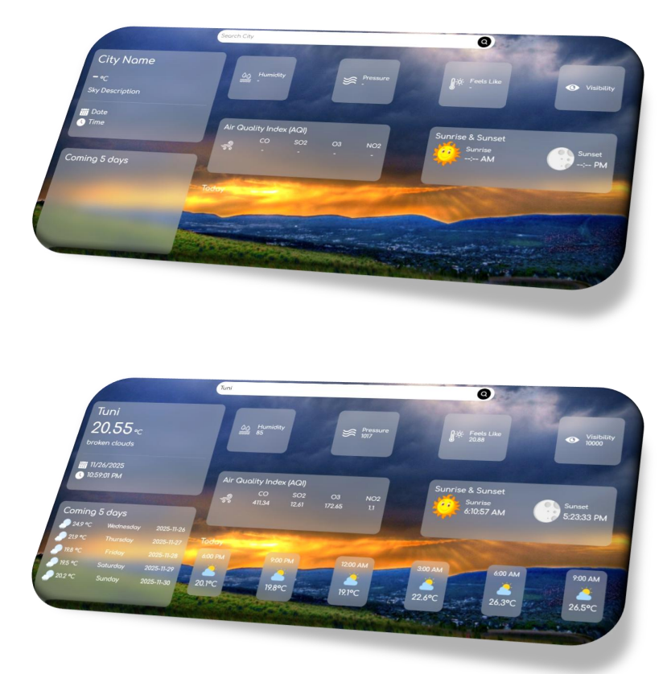
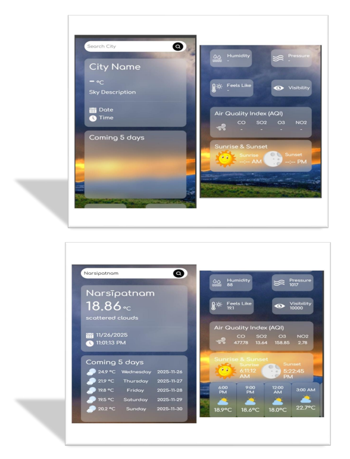

# Live Weather Dashboard

A beautiful and responsive weather application that provides real-time
weather updates, air quality index, and extended forecasts for any city
worldwide.

## App Preview

### Windows View



### Mobile View

  

## Table of Contents

  - [Overview](#overview)
  - [Features](#features)
  - [Technologies Used](#technologies-used)
  - [Project Structure](#project-structure)
  - [Installation](#installation)
  - [How to Use](#how-to-use)
  - [API Configuration](#api-configuration)
  - [Future Enhancements](#future-enhancements)
  - [Contributing](#contributing)
  - [License](#license)
  - [Author](#author)
  - [Acknowledgments](#acknowledgments)
  

## Overview

Live Weather Forecast is a clean, modern, fully responsive web
application that retrieves real-time weather data from the
OpenWeatherMap API. It shows temperature, conditions, humidity,
pressure, visibility, sunrise and sunset times, AQI, hourly forecast,
and a 5-day forecast.

## Features

-   Real-time weather
-   5-day forecast
-   Hourly forecast
-   Air Quality Index (CO, SO₂, O₃, NO₂)
-   Sunrise and sunset
-   Humidity, pressure, visibility, feels-like
-   Responsive UI
-   Glassmorphism design

## Technologies Used

-   HTML5
-   CSS3
-   JavaScript (ES6+)
-   Bootstrap 5.3.3
-   OpenWeatherMap API

## Project Structure

    Live-Weather-Forecast/
    │── index.html
    │── index.css
    │── /Images
    │     ├── weather.jpg
    │     ├── search.png
    │     ├── calendar.png
    │     ├── time.png
    │     ├── Humidity.png
    │     ├── Pressure.png
    │     ├── FeelsLike.png
    │     ├── Visibility.png
    │     ├── cloudy.png
    │     ├── cloud.png
    │     ├── sun.png
    │     ├── moon.png
    │     ├── wind.png
    │     ├── screenshot1.png
    └── README.md

## Installation

### 1. Clone the repository

``` bash
git clone https://github.com/yourusername/live-weather-app
```

### 2. Image Setup (IMPORTANT)

Images must stay in:

    ./Images/

GitHub is case-sensitive.\
`Humidity.png` is different from `humidity.png`.

### 3. Run the project

Open:

    index.html

## How to Use

1.  Enter a city name\
2.  Press Enter or click search\
3.  View weather, hourly updates, AQI, sunrise/sunset

## API Configuration

Replace your API key:

``` js
const apiKey = "YOUR_API_KEY";
```

## Future Enhancements

-   Weather alerts\
-   Auto geolocation\
-   C/F toggle\
-   Weather maps\
-   Favorite cities\
-   Dark/Light theme\
-   Multi-language support

## Contributing

1.  Fork\
2.  Create branch\
3.  Commit\
4.  Push\
5.  Pull request

## License

MIT License

## Author

**Raju Babu Panchada**\


## Acknowledgments

-   OpenWeatherMap\
-   Bootstrap\
-   Google Fonts\
-   Image/icon creators
-   
## Made by  ❤️* Raju Babu Panchada 
